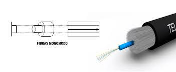
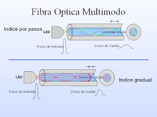

# Tema 3: Medios de Transimisión.

## Caracterización de las señales.

Tipos:
- Impulsos eléctricos (coaxial).
- Impulsos de luz (fibra).
- Ondas (inalámbrico).

Características de las señales:
- Periodo. Tiempo que tarda la señal en volver a repetirse. Segundos.
- Frecuencia. Número de veces que se repite la señal en cada segundo. Hz.
- Fase. Desde que comienza hasta que vuelve a tomar el valor 0 nuevamente (donde corta el eje x).
- Amplitud

Para aumentar la frecuencia hay que aumentar el periodo (disminuir la onda en el eje x).
*Recomendación libro:* Señales y sistemas (UDC) Oppenheim, Minsky.

**Teorema de Fourier: “Toda señal periódica se puede formar a partir de una señal fundamental y la suma de infinitos armónicos”.**

**Ancho de banda:** Rango de todas las frecuencias de una señal. Cuantas más frecuencias tenga una señal, más ancho de banda tendrá.

# TEMARIO EXAMEN
## Tipos de Transimisión
En condiciones ideales el 1 será 5V y el 0 será 0V.

Se utilizan márgenes de error ya que la señal enviada es la recibida más el ruido, por lo que los V variarán.

- **Señales digitales:** Función discreta, en al que únicamente se puede tomar un conjunto finito de valores en cada instante. En las binarias solo puede tomar los valores 0 y 1. Ordenador.
- **Señales Analógicas:** Funciones continuas, aquellas que pueden tomar cualquier valor entre un mínimo y un máximo en cada instante. Ejemplo: cuando transmitimos utilizamos este tipo de señal.
- Módem. Modula las señales, pasa de una a otra.
- El cable de alimentación de un ordenador transforma la corriente alterna en continua.

## Modulación
Proceso de modular (modificar, transformar) la señal en alguno de sus parámetros (periodo, frecuencia, amplitud, fase) para obtener su equivalente.
- **Señal portadora:** Es la señal modulada por una señal moduladora.
- **Señal moduladora:** Es la señal que modula.
- **Señal portadora + señal moduladora = señal modulada** (misma señal cortada a medida de la señal modular).

Tipos de modulación:
- Modulación analógica con portadora analógica. Varia alguna de sus características.
- Modulación digital con portadora analógica. Cambiar de señal analógica a una digital.
- Modulación analógica con portadora digital. Cambiar de señal digital a analógica.
- Banda base.

## Tipos de Cableado
Hay dos tipos de medios, nos centraremos más en los medios guiados.
- Medios guiados: Cuando se utiliza cableado.
- Medios no guiados: Cuando son conexiones inalámbricas.

Todo medio de transmisión se caracteriza por: 
- Velocidad de transmisión.
- Ancho de banda.
- Espacio entre repetidores. Dependiendo de la señal podremos distanciar más los repetidores.
- Fiabilidad de la transmisión.
- Coste.
- Facilidad de instalación.

### Cables:
- **Par sin trenzar (cable paralelo):** Son los cables de telefonía. Son los que tienen más interferencias. Categoría 1. El que menos protección tiene, tiene una cubierta de plástico. Son dos cables en paralelo. RJ11 (conector).

- **Par trenzado:** Ej: cable de red. RJ45 (conector). Se trenza para compensar las interferencias, reduce las interferencias que se puedan ocasionar. La instalación será más fácil, son más manejables que los paralelos; la conexión irá mejor. Los cables UTP (Unshielded Twisted Pair): son los que solo tienen las protección de los pares trenzados.

- **UTP:** Unshielded Twisted Pair. Solo tienen la protección de los pares trenzados, son los menos utilizados y tienen un coste muy bajo.

- **STP:** Shielded Twisted Pair. Hay una protección rodeando a cada par llamado pantalla. Ayuda a evitar las interferencias entre los cables.
- **FTP:** Fully Shielded Twisted Pair. La protección rodea a todos los pares, protección global. Con este no evitamos que haya interferencias entre los cables.
- **S/STP:** Screened Shielded Twisted Pair. Es el que más elimina interferencias y el ruido = mayor inmunidad al ruido. Mayor protección que podemos encontrar a nivel físico en los pares trenzados. Protección en cada par y, además, hay otra pantalla protegiendo a todos los cables(STP + FTP). Son los más caros. Más rígidos, por lo que son más complicados de manipular.

    

Hay 4 pares, lo que son 8 cables con los siguiente colores: azul (masa), blanco + azul (transmisión), naranja (masa), naranja + blanco (recepción), verde(masa), verde + blanco (transmisión), marrón (masa), marrón + blanco (recepción). El orden en que los pongamos importa. Unos mandarán la información y otros la recibirán. Los estándares que se utilizan son: T568A y T568B.

La diferencia entre ambas es cambiar un cable de transmisión por uno de recepción. 
    ## MONTAJE
    endremos:
    - **Cables Directos:** Cuando ambos extremos sean T568A ó T568B (más utilizado). Serán para conectar equipos de distinto tipo. Ej: switch y router.
    - **Cables Cruzados:** Cuando uno de los extremos sea T568A y el otro T568B. Cuando conectamos equipos del mismo tipo. Ej: 2 switches. Para que cuando uno emita vaya por la recepción del segundo y que cuando emita el segundo vaya por la recepción del primero. 

    Excepción: Conectar un ordenador con un router el cable tiene que ser cruzado porque internamente son iguales. En casa funcionaría con un cableado directo porque en el router hay un switch. El sentido del cable no influye.

- **Coaxial:** Conector de la tv. Dentro de los de cobre es el que más velocidad alcanza (incluso a 1 o 2 gbps). Nivel máximo en cobre, por encima ya estaría la fibra óptica. Hay coaxial grueso y coaxial fino.  
Partes:
    - Núcleo: hilo de cobre
    - Revestimiento aislante (plástico)
    - Malla metálica
    - Cubierta

        
        

- Tipos:

    - Coaxial banda base:
        - Se emplea en transimisión digital  
        - Grueso: Se utilizaba en redes locales. RG100 (1 cm de diámetro); RG150 (1,5 cm de diámetro).
        - Fino: Más empleado. Más flexibilidad, por lo que es más fácil de instalar.Menor protección contra el ruido = menor inmunidad al ruido.

    - Coaxial banda ancha:
        - Se emplea en transmisión analógica

- **Fibra Óptica:**
    - No es de cobre.
    - No emplea impulsos eléctricos, emplea **impulsos de luz**, por ello no sufre interferencias por campos electromagnéticos
    - Muy sensible.

Todo sistema de fibra tiene 3 componentes:
- Fuente de luz (en origen): Se encarga de generar un impulso de luz cuando queremos transmitir un 1 y de no generarlo si queremos mandar un 0.
- Fibra óptica (cable físico).
- Receptor (en destino): Transormará los impulsos de luz a 0's y 1's (lo opuesto a la fuente de luz). 

Partes del cable de fibra óptica:
- Cubierta: Parte externa de plástico.
- Revestimiento
- Hilo de fibra.

**Fibra monomodo:** El hilo de fibra es tan fino que prácticamente la luz va en línea recta, sin rebotar.

**Fibra multimodo:** El núcleo es más ancho por lo que la luz podrá rebotar.  

**Fibra multimodo con índice gradual:** La luz botará más suave, por lo que más que picos serán ondas. A medida que nos alejamos del centro hay más cambios (modificación gradual).

  
   

### Cómo seguir utilizando la fibra si se rompe

Hay tres formas de utilizarla:

- Utilizar un conector: Pérdida de 10-20% de luz, por lo que la transimisión será bastante deficiente
- Realizar una unión mécanica: Similar al conector, pero son uniones más perfectas. Hay que hacer un corte perfecto en un extremo del cable; hacemos lo mismo en el otro; después establecemos una unión mecánica (conectores especiales distintos de los conectores del punto anterior). Se pierde alrededor del 10%.
- Fundir los extremos: Soldamos ambos extremos (se utiliza una maquinaria especíifica). Es el más perfecto con un 5% de pérdida.  

## Medios Inalámbricos

- Ondas de radio: Se recepcionan ondas. Características:
    - Atraviesan objetos.

- Microondas: Wi-Fi -> Wireless Fidelity. Estándar:
    - IEEE 802.11 (protocolo)): Estándar que nos especifica las distintas versiones de la Wi-Fi.
        - a -> 5 GHz, 54 Mb/s
        - b -> 2.4 GHz, 11 Mb/s
        - g -> 2.4 GHz, 54 Mb/s
        - n -> 2.4 GHz - 5 GHz, 300M b/s
        - ac -> 2.4 GHz - 5 GHz, 1.3 Gb/s
    Teórico (en condiciones de kaboratorio), no se alcanza la velocidad máxima, hay pérdidas.

    - **SSID:** Identificador de la red.
    - **Canal:** Frecuencia en la que se emite la señal. La elección de la frecuencia es clave.
        - Ejemplos:
        En la banda de 2.4GHz, se suelen utilizar 13 o 14 canales:
            - 1-> 2,412 GHz (se centra en 2.412 GHz, hay que dejar 11 para atrás y 11 para adelante, en este caso sería: 2.401 a 2.423)
            - 2 -> 2.417 GHz (hay una diferencia de 0.005GHz = 5MHz)
            - 3 -> 2.422
            - 4 -> 2.4427
            - 5 -> 2.432
            - 6 -> 2.437
            - 7 -> 2.442
            - 8 -> 2.447
            - 9 -> 2.452
            - 10 -> 2.457
            - 11 -> 2.462
            - 12 -> 2.467
            - 13 -> 2.472
  
            - Rango de frecuencia de un canañ: 22 MHz  (11 + 11).

            - Los canales próximos entre si tendrán interferencias

            > Wifi analizer (programa para ver el uso de los canales).

            > Si hubiera 8 wifis en el canal 5, tampoco podríamos utilizar ni el 4 ni el 6, habría que ponerlo lo suficientemente alejado como para que no haya solapamiento

    ## Ejercicio 1: Calcular la interferencia entre el canal 1 y el 3: (EXAMEN)

    Recomendación: poner una línea y ponemos los canales 1 (2.412) y 3 (2.422)

    Valor inicial del canal 1: 2.401
    Valor final del canal 1: 2.423

    Valor inicial del canal 3: 2.411
    Valor final del canal 3: 2.433

    2.423 - 2.411 = 12 MHz

    ## Ejercicio 2: Calcular la interferencia entre el canal 1 y el 6

    Canal 1: 2.412
    Canal 6: 2.437

    Valor inicial del canal 1: 2.401
    Valor final del canal 1: 2.423

    Valor inicial canal 6: 2.426
    Valor final canal 6: 2.448

    No hay interferencia (hacer ejercicios en papel y poner la foto)

    ## Ejercicio 2: Calcular la interferencia entre el canal 6 y el 11

    No hay interferencia (comprobar)

    > La distancia mínima para que no haya solapamiento es 5.
  
    - **Cifrado:** WEP (no es seguro), WPA I-II (hoy en día se usa la WPA II, muy seguro).

## Probleamas durante la transmisión.

- Ruido Impulsivo: Interferencia muy fuerte y de muy corta duración (mucha amplitud, mucha frecuencia).

- Diafonía: Cuando dos o más cables están juntos y se interfieren entre sí (Dos cables de cobre, por ejemplo).

- Atenuación: Pérdida de intensidad de la señal a medida que recorre el espacio y el tiempo. Cable largo = mayor atenuación.

### Dispositivos de  Comprobación

- **Comprobador de continuidad:** Comprobará si hay continuidad en el cable, que no haya un corte, que esté bien crimpado el conector.

- **Comprobadores de cableado:** Incluyen a los comprobadores de continuidad, lo primero que hace es medir la continuidad del cable. Además, detecta si hay diafonía, atenuación...
 - **Reflectores del dominio del tiempo:** Incluye lo que hacen los dos anteriores. Reflectometría (medir reflejos). Capaz de especificar dónde están los problemas. Coloca el reflector al inicio del cable, emite una señal a lo largo de este, cuando llega a donde está roto rebota y regresa al aparato reflector. V = s / t. El reflector sabe la velocidad a la que emitimos la señal y sabe el tiempo que tarda en ir y en volver, por lo que podremos calcular el especio y saber el punto donde está el fallo. Es el más completo.

 > Inflarrojos: No atraviesa objetos. Va en línea recta.