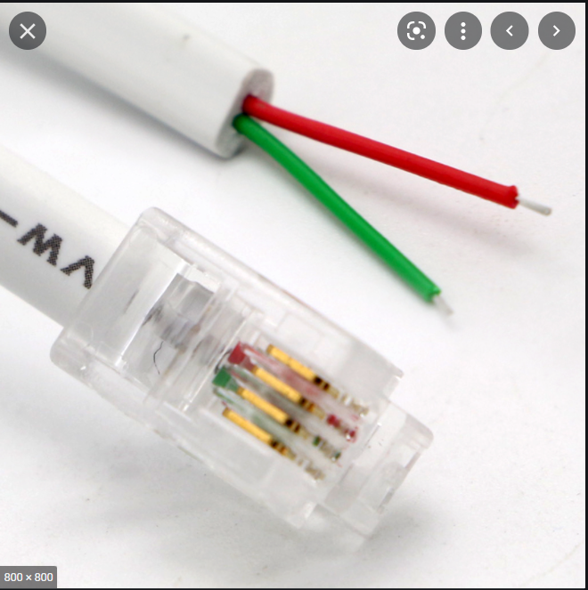
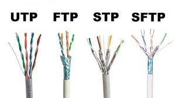
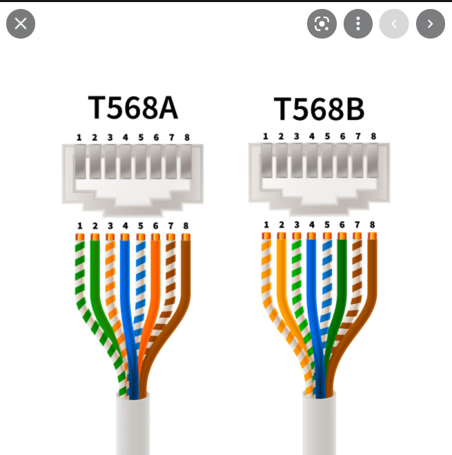
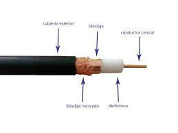
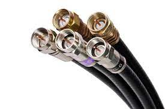

# Tema 3: Medios de Transimisión.

## Caracterización de las señales.

Tipos:
- Impulsos eléctricos (coaxial).
- Impulsos de luz (fibra).
- Ondas (inalámbrico).

Características de las señales:
- Periodo. Tiempo que tarda la señal en volver a repetirse. Segundos.
- Frecuencia. Número de veces que se repite la señal en cada segundo. Hz.
- Fase. Desde que comienza hasta que vuelve a tomar el valor 0 nuevamente (donde corta el eje x).
- Amplitud

Para aumentar la frecuencia hay que aumentar el periodo (disminuir la onda en el eje x).
*Recomendación libro:* Señales y sistemas (UDC) Oppenheim, Minsky.

**Teorema de Fourier: “Toda señal periódica se puede formar a partir de una señal fundamental y la suma de infinitos armónicos”.**

**Ancho de banda:** Rango de todas las frecuencias de una señal. Cuantas más frecuencias tenga una señal, más ancho de banda tendrá.

# TEMARIO EXAMEN
## Tipos de Transimisión
En condiciones ideales el 1 será 5V y el 0 será 0V.

Se utilizan márgenes de error ya que la señal enviada es la recibida más el ruido, por lo que los V variarán.

- **Señales digitales:** Función discreta, en al que únicamente se puede tomar un conjunto finito de valores en cada instante. En las binarias solo puede tomar los valores 0 y 1. Ordenador.
- **Señales Analógicas:** Funciones continuas, aquellas que pueden tomar cualquier valor entre un mínimo y un máximo en cada instante. Ejemplo: cuando transmitimos utilizamos este tipo de señal.
- Módem. Modula las señales, pasa de una a otra.
- El cable de alimentación de un ordenador transforma la corriente alterna en continua.

## Modulación
Proceso de modular (modificar, transformar) la señal en alguno de sus parámetros (periodo, frecuencia, amplitud, fase) para obtener su equivalente.
- **Señal portadora:** Es la señal modulada por una señal moduladora.
- **Señal moduladora:** Es la señal que modula.
- **Señal portadora + señal moduladora = señal modulada** (misma señal cortada a medida de la señal modular).

Tipos de modulación:
- Modulación analógica con portadora analógica. Varia alguna de sus características.
- Modulación digital con portadora analógica. Cambiar de señal analógica a una digital.
- Modulación analógica con portadora digital. Cambiar de señal digital a analógica.
- Banda base.

## Tipos de Cableado
Hay dos tipos de medios, nos centraremos más en los medios guiados.
- Medios guiados: Cuando se utiliza cableado.
- Medios no guiados: Cuando son conexiones inalámbricas.

Todo medio de transmisión se caracteriza por: 
- Velocidad de transmisión.
- Ancho de banda.
- Espacio entre repetidores. Dependiendo de la señal podremos distanciar más los repetidores.
- Fiabilidad de la transmisión.
- Coste.
- Facilidad de instalación.

### Cables:
- **Par sin trenzar (cable paralelo):** Son los cables de telefonía. Son los que tienen más interferencias. Categoría 1. El que menos protección tiene, tiene una cubierta de plástico. Son dos cables en paralelo. RJ11 (conector).

- **Par trenzado:** Ej: cable de red. RJ45 (conector). Se trenza para compensar las interferencias, reduce las interferencias que se puedan ocasionar. La instalación será más fácil, son más manejables que los paralelos; la conexión irá mejor. Los cables UTP (Unshielded Twisted Pair): son los que solo tienen las protección de los pares trenzados.

- **UTP:** Unshielded Twisted Pair. Solo tienen la protección de los pares trenzados, son los menos utilizados y tienen un coste muy bajo.

- **STP:** Shielded Twisted Pair. Hay una protección rodeando a cada par llamado pantalla. Ayuda a evitar las interferencias entre los cables.
- **FTP:** Fully Shielded Twisted Pair. La protección rodea a todos los pares, protección global. Con este no evitamos que haya interferencias entre los cables.
- **S/STP:** Screened Shielded Twisted Pair. Es el que más elimina interferencias y el ruido = mayor inmunidad al ruido. Mayor protección que podemos encontrar a nivel físico en los pares trenzados. Protección en cada par y, además, hay otra pantalla protegiendo a todos los cables(STP + FTP). Son los más caros. Más rígidos, por lo que son más complicados de manipular.

    

Hay 4 pares, lo que son 8 cables con los siguiente colores: azul (masa), blanco + azul (transmisión), naranja (masa), naranja + blanco (recepción), verde(masa), verde + blanco (transmisión), marrón (masa), marrón + blanco (recepción). El orden en que los pongamos importa. Unos mandarán la información y otros la recibirán. Los estándares que se utilizan son: T568A y T568B.

La diferencia entre ambas es cambiar un cable de transmisión por uno de recepción. 
    ## MONTAJE
    endremos:
    - **Cables Directos:** Cuando ambos extremos sean T568A ó T568B (más utilizado). Serán para conectar equipos de distinto tipo. Ej: switch y router.
    - **Cables Cruzados:** Cuando uno de los extremos sea T568A y el otro T568B. Cuando conectamos equipos del mismo tipo. Ej: 2 switches. Para que cuando uno emita vaya por la recepción del segundo y que cuando emita el segundo vaya por la recepción del primero. 

    **Excepción:** Conectar un ordenador con un router el cable tiene que ser cruzado porque internamente son iguales. En casa funcionaría con un cableado directo porque en el router hay un switch. El sentido del cable no influye.

- **Coaxial:** Conector de la tv. Dentro de los de cobre es el que más velocidad alcanza (incluso a 1 o 2 gbps). Nivel máximo en cobre, por encima ya estaría la fibra óptica. Hay coaxial grueso y coaxial fino.  
Partes:
    - Núcleo: hilo de cobre
    - Revestimiento aislante (plástico)
    - Malla metálica
    - Cubierta

        
        

